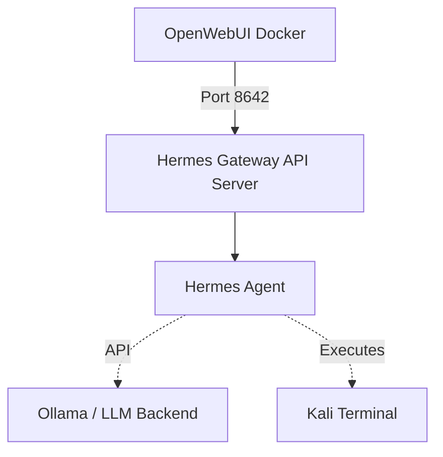
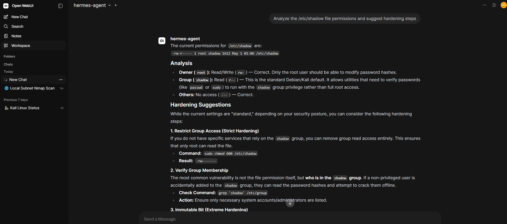

# 🤖 Deploying a Cyber-Centric AI Lab: Hermes Agent + Open WebUI

This repository documents the installation and integration of the **Hermes Autonomous Agent** with **Open WebUI** inside a **Kali Linux Virtual Machine (e.g., VMware)** environment. This setup creates a powerful, browser-accessible command center where an AI agent can autonomously execute terminal tools, perform network scans, and assist in cybersecurity workflows directly from your VM.

Everything runs locally. Nothing is exposed externally.

## 🏗 System Architecture

The setup relies on a straightforward vertical flow. Open WebUI sends requests to the Hermes Gateway, which then serves as the bridge to the Hermes Agent.



## 📋 Prerequisites

Before starting, ensure you have the following installed on your Kali VM:
- **Python 3.10+** (For Hermes Agent)
- **Docker & Docker Compose** (For Open WebUI)
- **Ollama** (If running local LLM models)

---

## 🚀 Step 1: Installing the Hermes Agent

The Hermes Agent is a tool-augmented LLM framework. We install it directly on the Kali host so it has native access to the terminal and security tools.

For a 100% offline and private setup, the quickest method is using Ollama to install and launch the agent locally:

```bash
ollama install hermes agent
ollama launch hermes --model gemma4:31b-cloud
```


For alternative installation methods or advanced setups, please refer to the [Hermes Agent Documentation](https://hermes-agent.nousresearch.com/docs/getting-started/installation).

**Initialization:** After installation, initialize the configuration folder:
```bash
hermes setup
```
This creates the `~/.hermes/` directory where your configurations and API keys will live.

---

## 🧠 Step 2: LLM Backend Configuration (Optional)

If you prefer to use an external cloud provider like **OpenRouter** rather than a local Ollama model, you will need to configure your respective API keys in the Hermes environment settings in the next step.

---

## ⚙️ Step 3: Configuring the Gateway API

By default, Hermes is a CLI tool. To make it talk to Open WebUI, we must enable its API Gateway.

**Edit the Environment File:**
```bash
nano ~/.hermes/.env
```

**Enable the Server:** Add or modify these lines. We use `0.0.0.0` to allow the Docker container to "see" the host service:
```env
API_SERVER_ENABLED=true
API_SERVER_PORT=8642
API_SERVER_HOST=0.0.0.0
API_SERVER_KEY=your_secure_api_key
```

**Start the Gateway:** Run this in a dedicated terminal window:
```bash
hermes gateway
```

---

## 🐳 Step 4: Deploying Open WebUI via Docker

We use Docker to keep the UI isolated and clean. Because the UI is in a container and Hermes is on the host, we use the `--add-host` flag to bridge the network gap.

**1. Pull the image**
```bash
docker pull ghcr.io/open-webui/open-webui:main
```

**2. Run the container**
```bash
docker run -d -p 3000:8080 --add-host=host.docker.internal:host-gateway -v open-webui:/app/backend/data --name open-webui ghcr.io/open-webui/open-webui:main
```

- **`-p 3000:8080`**: Maps the UI to port 3000, making it accessible from your host machine via the Kali IP.
- **`--add-host`**: This is the "secret sauce" that allows the container to use the hostname `host.docker.internal` to reach your Kali host.

For more details on deployment, refer to the [Open WebUI Documentation](https://docs.openwebui.com/getting-started/quick-start/).


---

## 🔗 Step 5: Final Integration

**Access the Dashboard:** Open your browser and navigate to `http://<KALI_IP>:3000`.


**Navigate to Connections:** Go to **Settings** > **Admin settings** > **Connections** > **OpenAI API**.

**Configure the Bridge:**
- **API Base URL:** `http://host.docker.internal:8642/v1`
- **API Key:** Use the key you defined in Step 3 (`your_secure_api_key`).

> **Important:** You must include `/v1` in the Base URL.


**Verification:** Click the Refresh icon. If the checkmark turns green, `hermes-agent` will appear in your model list.

---

## 🎯 Use Case: Cybersecurity Automation

With this setup, you can ask Hermes to perform tasks directly in the chat:

- *"Run a quick nmap scan on the local subnet and summarize the open ports."*


- *"Analyze the /etc/shadow file permissions and suggest hardening steps."*



The agent will execute these commands in your Kali terminal and return the output beautifully formatted in your browser.

---

## 🔒 Security Notes

- This setup is designed for a local/internal lab environment.
- **Do not** expose port `8642` or `3000` to the public internet without proper proxying, authentication, and TLS.
- Secure your `API_SERVER_KEY` to prevent unauthorized command execution on your host.

## 🛠 Troubleshooting

If Open WebUI cannot connect to Hermes, run these checks from your Kali host:

Verify Hermes is listening on all interfaces:
```bash
ss -tulnp | grep 8642
```

Test the API directly:
```bash
curl http://localhost:8642/v1/models
```

---

## ⚠️ Disclaimer

**This lab environment and setup are intended for educational purposes and authorized penetration testing only.** 
Do not use this toolset against networks, applications, or infrastructure you do not own or do not have explicit permission to test. You are solely responsible for your actions.
